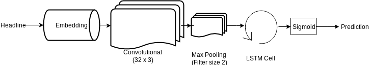

# Stock Market prediction using news headlines

### Joshua van Kleef, Valerie Scholten and Emiel Stoelinga

Cognitive Computational Modeling of Language and Web Interaction
June 19, 2017

## Abstract

The stock market is a very volatile environment. This volatility can be influenced by positive or negative press releases. This study shows that there is an effect of news headlines on the stock market and that the stocks can be predicted with the use of those news headlines. Technology data in general and company specific data of Microsoft, Google and IBM are used to test the effect of the headlines on the stock market. Two different approaches are experimented with: sentiment analysis and LSTM. The results show that it is possible to predict the stock market with the use of news headlines, where the LSTM method was able to predict more accurately than the sentiment analysis method.

## Introduction

The stock market is subject to rapid changes. It is very difficult to predict what will happen to the stock market in general or the stocks of a particular company. A significant amount of money can be earned or saved when the stock market trend for the day itself or the next day can be predicted. It is not strange to see a connection between news headlines and the stock market trend. If a company gets negative press, it is understandable that the stocks of this particular company will go down as a consequence of this negative news. It could be possible that by analyzing news headlines the stock market trend in general or that of a particular company can be predicted.

This report will go into the analysis of news headlines to determine if there is a correlation between news headlines and the stock market and if said correlation is present, how well the stocks can be predicted. First, in the background section, previous research about predicting stocks with the use of news headlines analysis, in particular sentiment analysis, is discussed. This is followed by a description of the experiments that are performed with their corresponding results. After this, a summary is provided that will link together the previous research and the research introduced in this report, ending with a conclusion about these experiments.

### Background

One of the main goals in the financial world is to predict stock prices to ensure that the profit will be the highest possible. Many research has been performed in the field of predicting stocks, where using Twitter messages to predict the stock price is a very popular approach (Bollena et al. 2011; Zhang et al. 2011). Some of the research done in this field focuses on the idea of combining stock prices with news headlines, as is the subject of this paper (Kalyani et al. 2016; Kirange and Deshmukh, 2016; Wong et al. 2011).

Kalyani et al. (2016) collected Apple Inc. stock information over a time span of three years. Additionally, they collected news data about this company over the same time span. The news data has been collected from several news websites, such as news.google.com and finance.yahoo.com. First, the news articles were preprocessed and a sentiment detection algorithm was used to detect the sentiment of these news articles. The sentiment detection algorithm worked with a dictionary of positive and negative words, where the news article was transferred into a count of positive and negative words. The results of the sentiment detection were then used in classification algorithms, i.e. SVM, Random Forest and Naive Bayes. The results of these classifiers show an accuracy of 75% to 90% on an unseen dataset.

Other research, by Kirange and Deshmukh (2016), follow roughly the same structure as the research mentioned above, but they used news and stocks of Indian companies over a period of 10 years. The sentiment detection is performed in a similar manner, using a dictionary of positive and negative words, and the classification algorithms used are SVM, KNN and Naive Bayes. The results for this research report an accuracy between 47% and 75%.

The problem with these papers is that they have used different approaches and they all use different datasets from different sources in a different timespan, so it is difficult to compare these results with each other.

In this project, approaches from the different research papers are taken into account and several experiments are performed to predict the stock trend using news headlines and to determine which approach leads to the most accurate result.

## Project

### Sentiment Analysis

#### Stock market prediction: predicting the Dow Jones Industrial Average

##### A first try

A first try of predicting the stock market was done by predicting the Dow Jones Industrial Average (DJIA) with a top 25 of news headlines extracted from Reddit. Data was provided through Kaggle (https://www.kaggle.com/aaron7sun/stocknews) and included data points over a period of roughly 8 years. Every data point represented a single day and contained a boolean which indicated whether the Dow Jones Industrial Average decreased (0) or stayed the same or increased (1). Furthermore, every datapoint contained the top-25 of news headlines from Reddit.

For every instance, average sentiment of the 25 news headlines was calculated using NLTK's Sentiment Intensity Analyzer (Bird et al., 2009). The compound sentiment value was taken as sentiment score. The average sentiment was used to train a support vector machine (SVM) with a linear kernel using 70% of the dataset as training set. The remaining part of the dataset was thereafter used in order to predict whether the DJIA went up or went down. Five-fold cross-validation resulted in an average accuracy of 51.1% on the test set.
Given that 50.8% of the labels in the test set had the value '1' (stock stays the same or increases), the SVM seemed to perform at chance level.

##### Narrowing it down

Using the average sentiment for a given day could result in a loss of information which, in turn, could be a reason for poor accuracy in the previous experiment. Therefore, the dataset was decomposed such that every row contained a value which indicated what happened with the DJIA, a single news headline and its sentiment score. The SVM was thereafter trained in the same way, again with a linear kernel.
Five-fold cross-validation resulted in an average accuracy of 50.3%, which is slightly below chance level accuracy of 50.8%.

#### Stock market prediction: predicting technology stocks

Prediction of the DJIA using the top-25 news headlines did not seem to result in an accuracy significantly higher than chance. Therefore, sentiment analysis was further narrowed down into a specific field: a new approach was to predict change in a technological company's stock using technology headlines only, as these seemed to be more related.
As a dataset, a set from Kaggle (https://www.kaggle.com/uciml/news-aggregator-dataset) was chosen which included news headlines categorized into multiple classes over a period of five months. The data was combined with boolean values which illustrated whether stocks for the specific companies decreased, stayed the same or increased.
The current study focused on headlines which regarded technology, hence all those news headlines were extracted from the dataset. Furthermore, indications of changes in the stocks for the companies Microsoft, Google and IBM were included. These values represented separate changes in stock value for the day the news headline was brought out and the day after.

##### Using all technology headlines

As a first endeavor, changes in Microsoft's stocks were predicted using the average sentiment of technology news headlines over a period of one day. A support vector machine was trained using 70% of the dataset. The average accuracies on the test set using five-fold cross-validation were 65.3% for the day the news headline came out and 73.0% for the day after the news headline came out, with chance level accuracies of 65.6% and 72.4% respectively.

Accuracy seems to still be at chance level. Furthermore, due to the calculation of average sentiments for certain days, the test set appeared to be a total of only 29 instances. The training set consisted of 65 examples. Accuracy values are heavily influenced by change with test sets of a certain limited size, which is why another new method was chosen afterwards.

##### Using company specific headlines

In order to keep using a dataset with a sufficient size and meanwhile using headlines and stock values that are related, the previous dataset was utilized in a different way. The dataset was first filtered such that the result was a table with technology news headlines only. Thereafter, for the companies Microsoft, Google and IBM, the set was filtered such that three sets of data remained containing only headlines about the specific company. These sets were further extended by including values which indicated change of the company's stock the day the news headline came out, one day later and two days later. Furthermore, for every headline the sentiment was calculated. The result was a total of three datasets containing only technology headlines about the concerning company.

Again, separate SVMs were trained which predicted the change of stock value separately for today, tomorrow and the day after tomorrow. Results are presented in Table 1, under 'only company specific headlines'. Accuracy was calculated using five-fold cross-validation, using 30% of the dataset as test data. As a result the test sets had sizes of 1935, 3327, 219 instances for Microsoft, Google and IBM respectively. The baseline accuracy values were 57.1% for Microsoft, 57.7% for Google and 85.9% for IBM.

In addition, for every instance, the average sentiment in technology headlines for the associated day was included in a new column and included in the stock prediction. This resulted in classification with multiple features and three new SVMs were trained using the same parameters. Results are presented in Table 1, under 'company specific headlines & tech average'.
As can be seen, the addition of average technology sentiment did not enhance accuracy significantly. Only for the prediction of Microsoft's stock two days after the news headline, did the extension produce a (minimal) change in accuracy. We expected this to be due to differences in scale of the sentiment scores. The sentiment scores for the single headlines had values between -1 en +1. Averaging sentiments from multiple headlines, resulted in small values close to 0. As a solution, scaling of the average sentiment scores was performed. However, did did not result in any change of accuracy.

| Company | Only company specific headlines ||| Company specific headlines & tech average |||
| --- | --- | --- | --- | --- | --- | --- |
|        | Today | Tomorrow | D.a. tomorrow | Today | Tomorrow | D.a. tomorrow |
| Microsoft | 57.1%    | 63.2% | 55.1% | 57.1% | 63.2% | 55.9%    |
| Google     | 57.7%    | 59.3% | 58.2% | 57.7% | 59.3% | 58.2% |
| IBM         | 85.9%    | 51.1% | 67.6%    | 85.9% | 51.1% | 67.6% |

Table 1: accuracy of stock prediction using sentiment analysis on company specific headlines

### LSTM Network

For sentiment analysis it has been shown that the accuracy of predicting the stocks is not significantly better than predicting stochastically. Our next approach is to use a LSTM network to predict the stocks. LSTM is a type of recurrent neural network that preserves its state (Schmidhuber et Al., 1997). LSTM networks have already been proven successfully with text data for applications such as NLP(Sundermeyer et Al., 2012) and machine translation (Cho et Al., 2014). Because the headlines are also text based, the reasonable decision was to apply this type of network to our type of data. The type of problem that we face is a typical classification problem, so the network that needs be designed needs to be a classification network. This is a typically neural network that outputs a fully connected layer with a sigmoid or softmax activation function.  The architecture of the network that we used is shown in figure 1. In the next sections this network is discussed in detail

Figure 1: Network architecture used to predict the stocks

#### Network

##### Input

As shown in figure 1 the headlines are used as input for the neural network. These headlines are preprocessed and all non alphabetical characters are removed from the input. All remaining characters are converted to lowercase inputs to overcome double identical words with a different capitalization. For the word embeddings the top 2000 words in the corpus are used to convert the words to the proper index. All other words that were not present in the top 2000 words are set to an index of zero. The maximal size of the word embeddings is 100 and zero padded for smaller headlines.

##### Convolutional and Max Pooling Layer

The word embeddings are fed to a 1D convolutional layer with a kernel size of 3 and 32 filters. Adding a separate convolutional layer to a recurrent neural network is not a traditional approach. The justification of adding a convolutional layer before a LSTM cell is that convolutions  excel at mapping spatial structure in input data. The hypothesis is that the latent sentiment features are represented by the filters in this layer, since the output of this network is an indicator of how well the stocks are performing and via backpropagation this features can then  be learned.  A kernel size of 3 has been chosen, because the surrounding words are then also used for the filters to account for direct negation of words.  A max pooling layer is added after the convolutional layer to make the filters location invariant.

##### LSTM Cell

The output of the convolutional filters are used as input for the LSTM Cell.  ThIs is a traditional LSTM cell with the number of units set to 100, a hyperbolic tangent activation function and a hard sigmoid recurrent activation function. A GRU Cell (Chung et Al., 2015) has also been used, but this did improve the network, but only worsened.

##### Output layer

A sigmoidal activation function has been used for the output layer, because the network outputs a vector with a size of 1.  If there was chosen for a softmax activation function, the output always becomes 1, since this is the only cell present in the output.

##### Hyperparameters, loss function and optimizer

The loss function that has been used to train the network is a binary cross entropy loss function, since it is an binary classification problem. The network has been optimized by the Adam optimization function (Kingma et Al., 2014). The learning rate at the beginning is set to 0.001 with a learning rate decay of 0.1 when the validation loss did not improve any more for 5 epochs. The learning rate decay did not provide for any additional performance for the network.

##### Data

The same data set has been used for the LSTM network as the sentiment analysis described in the section "Stock market prediction: predicting technology stocks". Different datasets has been used to train different models on. Per day per company and per type of headline the different datasets were composed. This resulted in 18 (3 days x 3 companies x 2 type of headline) different data sets that were trained on. All these datasets were split into a 80-10-10 training, validation and test set.

##### Training

The implementation of the model has been done in Keras using a Tensorflow backend. This framework has been chosen because it has a high level abstraction that makes fast prototyping possible. The models converged pretty quickly after 10 epochs on a NVIDIA GTX 1050 GPU, which resulted in a training time of 10 minutes per model.

##### Results

The results of the performance of the LSTM network are shown in table 2. All the results are reported on the held out test set

| Company | Company specific & Tech headlines ||| Company specific Headlines |||
| --- | --- | --- | --- | --- | --- | --- |
|        | Today | Tomorrow | D.a. tomorrow | Today | Tomorrow | D.a. tomorrow |
| Microsoft | 69.7%    | 71.9% | 74.4% | 71.0% | 73.0% | 79.5%    |
| Google     | 71.1%    | 72.1% | 79.1% | 76.5% | 78.8% | 81.3% |
| IBM         | 68.6%    | 71.7% | 73.8%    | 93.1% | 55.6% | 83.3% |

Table 2: accuracy of stock prediction using an LSTM Network on headlines

The results of this model outperforms the sentiment analysis earlier discussed in this report. An aspect that stands out is that the LSTM performs better when the time progresses. So the network predict the stocks for the day after tomorrow overall better than today.

## Summary

Stock market prediction is a field in which a significant amount of money can be earned and saved. The optimal solution is to be able to predict the stocks of the next day or the day after that. Earlier research has shown that it is possible to predict the stock market with the use of news headline analysis, in particular sentiment analysis. It is difficult though to compare earlier performed research both with each other and with research introduced in this report. The problem is that different approaches and data are used in all papers, so this paper uses one dataset to compare the results of different methods.
Two methods were introduced in this report, a sentiment analysis method and a LSTM method. Both have used the same dataset, so it is possible to compare the two methods with each other. The LSTM method resulted in a significantly higher accuracy of predicting the stocks for today, tomorrow and the day after tomorrow than the sentiment analysis method. This is the case for both the technology headlines in general and the company specific headlines.

## Conclusions

From the results of the experiments, it can be concluded that the LSTM approach yields better results than the sentiment analysis approach, it can predict whether the stocks go up or down more accurately than the sentiment analysis approach. The results also show that the LSTM can predict future states better than present states.
The sentiment analysis algorithm has a performance around chance for both the company specific news headlines and the technology headlines in general. The addition of average techonology sentiment did not enhance performance for predicting the stock trend.

There is some future work that could still be experimented with. For instance, the classifier could be trained on more companies instead of one specific company. This will result in a more general classifier that can classify the stocks for multiple companies. Another improvement is to include the certainty of the sentiment of a news headline. This can help to further improve the classifier so it generates more accurate results.

## Link to code

https://github.com/EmielStoelinga/CCMLWI

## Author contribution

Joshua: LSTM approach, wrote: LSTM part of project section

Valerie: worked on topic modeling and bag of words model, but those did not give significant results that helped answer the research question, so they were not reported. wrote: abstract, introduction, background section, summary, conclusion

Emiel: sentiment analysis approach, wrote: sentiment analysis part of project section

## References

Cho, Kyunghyun, et al. "Learning phrase representations using RNN encoder-decoder for statistical machine translation." arXiv preprint arXiv:1406.1078 (2014).

J. Kalyani, H. N. Bharathi, and R. Jyothi, Stock trend prediction using news sentiment analysis, CoRR, abs/1607.01958 (2016).

D. Kirange and R. R. Deshmukh, Sentiment analysis of news headlines for stock price prediction, 5 (2016).

F. M. F. Wong, Z. Liu, and M. Chiang, Stock market prediction from WSJ: text mining via sparse matrix factorization, CoRR, abs/1406.7330 (2014).

S. Hochreiter and  Schmidhuber. "Long short-term memory." Neural computation 9.8 (1997): 1735-1780.

J. Bollena, H. Maoa, and X. Zengb, Twitter mood predicts the stock market, Journal of Computational Science, 2 (2011)

D. Kingma, and J. Ba. "Adam: A method for stochastic optimization." arXiv preprint arXiv:1412.6980 (2014).

Chung, Junyoung, et al. "Gated feedback recurrent neural networks." International Conference on Machine Learning. 2015.

M. Sundermeyer, R. Schlüter, and H. Ney. "LSTM Neural Networks for Language Modeling." Interspeech. 2012.

X. Zhang, H. Fuehres, and P. A. Gloor, Predicting Stock Market Indicators Through Twitter “I hope it is not as bad as I fear, Procedia - Social and Behavioral Sciences, 26 (2011)

S. Bird, E. Loper and E. Klein, Natural Language Processing with Python,  O’Reilly Media Inc. (2009)

